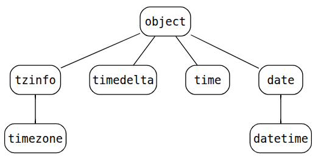

# Datetime

This module supplies classes for manipulating dates and times. For example, date/time arithmetic or attribute extraction for output formatting and manipulation

## Aware and naive objects

Date and time objects may be categorized as **aware** or **naive** depending on whether or not they include **timezone information**

- An **aware** object can locate itself relative to other aware objects
- A **naive** object does not contain enough information to unambiguously locate itself relative to other date/time objects

To determine if an object is aware or naive, see [the docs](https://docs.python.org/3/library/datetime.html#determining-if-an-object-is-aware-or-naive)

## Classes Relationship

## strftime() and strptime() behavior

|           | `strftime`  | `strptime`  |
| --------- | --------- | --------- |
| **Usage**     | Convert object to a string according to a given format | Parse a string into an object given a corresponding format |
| **Type of method**    | Instance method   | Class method |
| **Signature** |`strftime(format)`|`strptime(date_string, format)`|

Example: [format_code.py](format_code.py)

For a list of all the format codes, see [strftime() and strptime() format codes](https://docs.python.org/3/library/datetime.html#strftime-and-strptime-format-codes)