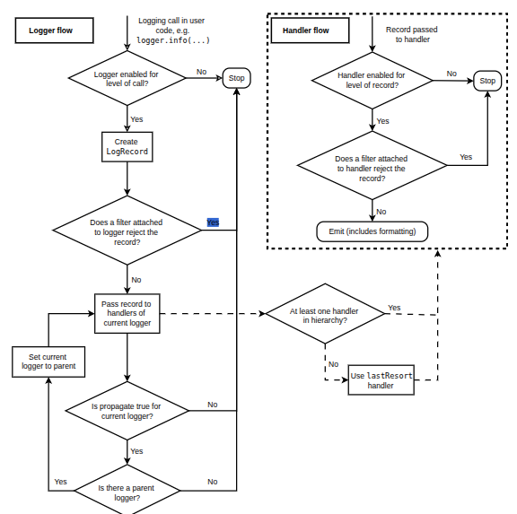

# Logging

This module defines functions and classes which implement a flexible event logging system for applications and libraries

The key benefit of having the **logging API** provided by a standard library module is that all Python modules can participate in logging, so your application log can include your own messages integrated with messages from third-party modules

## Example

```python
# myapp.py
import logging
import mylib

logger = logging.getLogger(__name__) # creating a module-level logger

def main():
    logging.basicConfig(filename='myapp.log', level=logging.INFO)
    logger.info('Started')
    mylib.do_something()
    logger.info('Finished')

if __name__ == '__main__':
    main()
```

```python
# mylib.py
import logging

logger = logging.getLogger(__name__)

def do_something():
    logger.info('Doing something')
```

If you run `myapp.py`, you should see this in `myapp.log`

```txt
INFO:__main__:Started
INFO:mylib:Doing something
INFO:__main__:Finished
```

**Hierarchical logging**: logged messages to the module-level logger get forwarded to handlers of loggers in higher-level modules, all the way up to the highest-level logger known as the **root logger**

Only the root logger needs to be so configured, and [basicConfig()](https://docs.python.org/3/library/logging.html#logging.basicConfig) provides a quick way to do that

The main classes in `logging` module
- `Loggers`: expose the interface that application code directly uses
- `Handlers`: send the log records (created by loggers) to the appropriate destination
- `Filters`: provide a finer grained facility for determining which log records to output
- `Formatters`: specify the layout of log records in the final output

## Basics

**Logging** is a means of **tracking events** that happen when some software runs. An event is described by a descriptive **message** which can optionally contain variable data (i.e. data is potentially different for each occurrence of the event). Each event also have an importance which the developer decribes to that event (aka **level or severity**)

Standard levels of severity (in increasing order of severity): `DEBUG`, `INFO`, `WARNING` (default), `ERROR`, `CRITICAL`. To determine when to use logging, and to see which logger methods to use when, see [When to use logging](https://docs.python.org/3/howto/logging.html#when-to-use-logging)

For a full set of things that can appear in format strings (`format` argument in [basicConfig()](https://docs.python.org/3/library/logging.html#logging.basicConfig)), you can refer to [LogRecord attributes](https://docs.python.org/3/library/logging.html#logrecord-attributes)

`datefmt` argument in [basicConfig()](https://docs.python.org/3/library/logging.html#logging.basicConfig) is supported by [time.strftime()](https://docs.python.org/3/library/time.html#time.strftime)

**Notes**
- Only events with a severity level equal to or higher than the configured level will be tracked
- The call to `basicConfig()` should come before any calls to a logger’s methods (e.g., `debug()`, `info()`...)

## Advanced

### Flow of log event information in loggers and handlers



### Configuring Logging

Programmers can configure logging in three ways

1. Creating loggers, handlers, and formatters explicitly using Python code: [tutorial_advanced.py](tutorial_advanced.py)
2. Creating a logging config file (`logging.conf`) and reading it using the [fileConfig()](https://docs.python.org/3/library/logging.config.html#logging.config.fileConfig) function
3. Creating a dictionary of configuration information and passing it to the [dictConfig()](https://docs.python.org/3/library/logging.config.html#logging.config.dictConfig) function

If **no logging configuration is provided** (no handlers, no formatters), then, the event is output using a [lastResort](https://docs.python.org/3/library/logging.html#logging.lastResort) 
- Writes the event description message to the current value of `sys.stderr`
- No formatting is done on the message - just the bare event description message is printed. The handler’s level is set to `WARNING`

### NullHandler

When you don’t want messages printed in the absence of any logging configuration, you can attach a do-nothing handler to the top-level logger for your library ([NullHandler](https://docs.python.org/3/library/logging.handlers.html#logging.NullHandler))

```python
import logging
logging.getLogger('foo').addHandler(logging.NullHandler())
```

**Notes for configure logging for a library**
- It is strongly advised that you do not log to the root logger in your library. Instead, use a logger with a unique and easily identifiable name, such as the `__name__` for your library’s top-level package or module
- It is strongly advised that you do not add any handlers other than `NullHandler` to your library’s loggers. Which handler is used is up to the application developer side